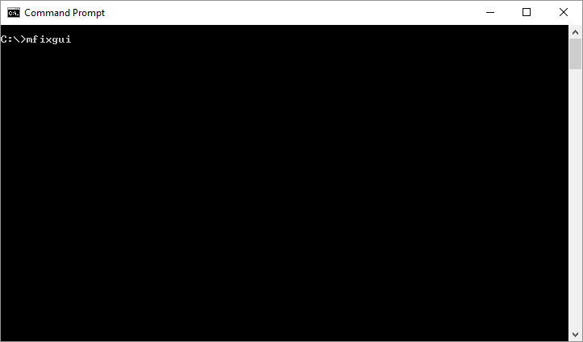
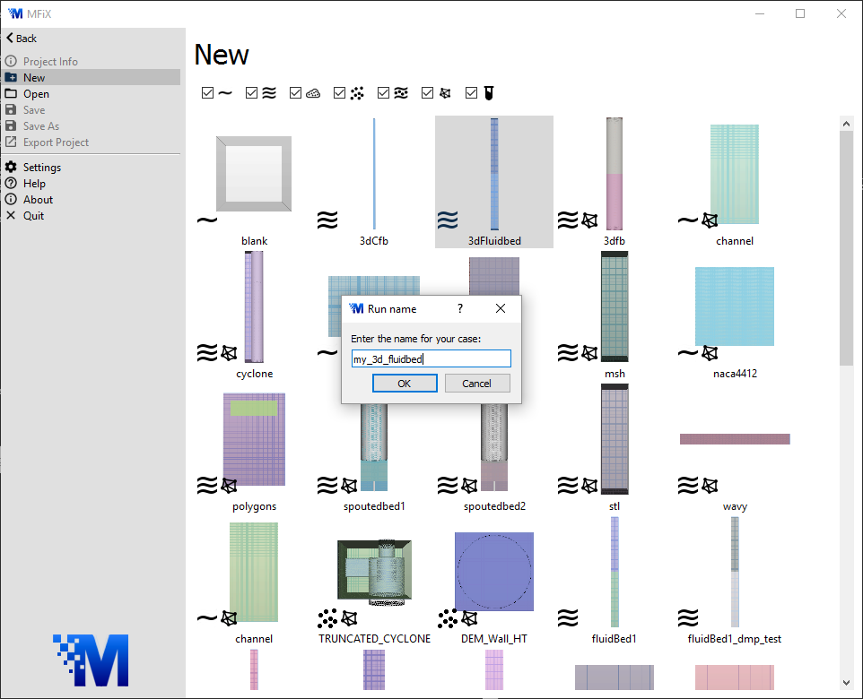
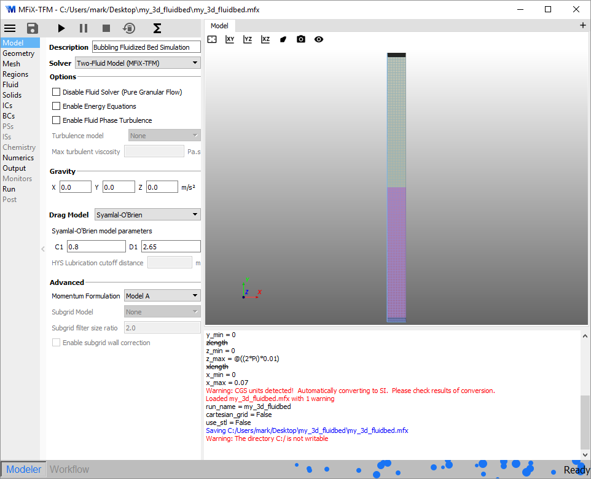
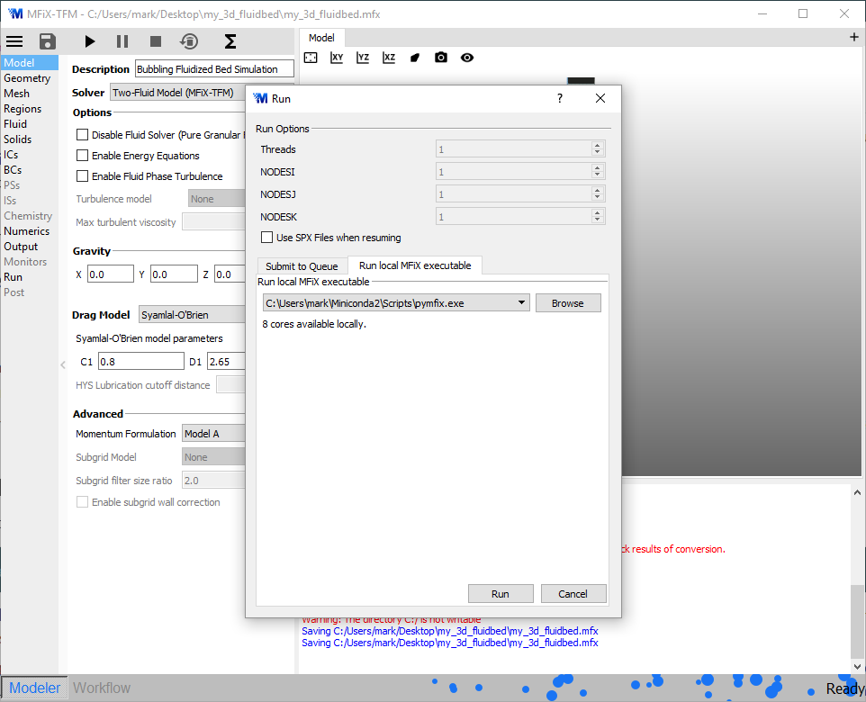
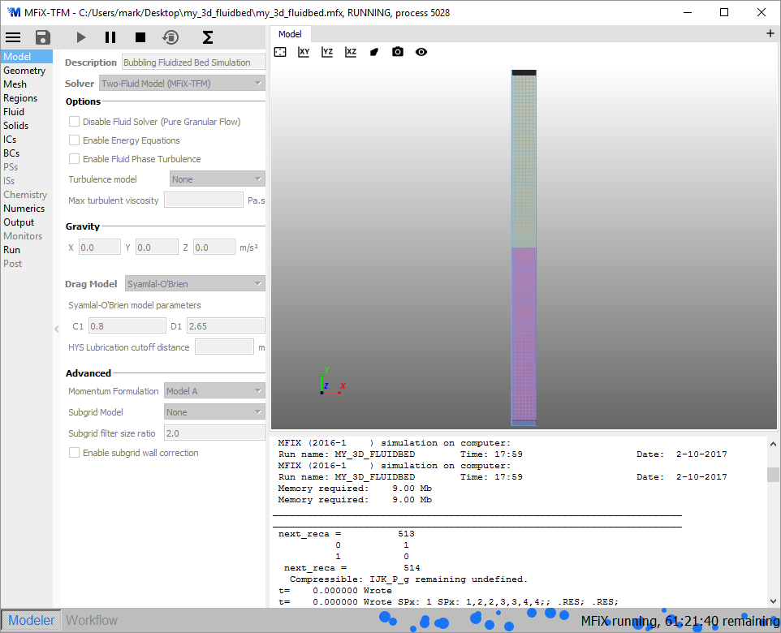

# MFIX User Guide

This document explains how to run MFIX 17.1, using either the GUI or the command line.

This document assumes MFIX is already installed. For information on building or
installing MFIX, please see the setup guide: [INSTALL.md](INSTALL.md)

Everything in this document applies to each platform (Linux, Mac, Windows)
unless otherwise noted.

## About MFIX

MFIX is an open-source multiphase flow solver and is free to download and use. A
one-time no-cost registration is required prior to downloading the source code.
To register, go to https://mfix.netl.doe.gov/ and click on the "Register" button
in the upper right corner. Once you have read the notice, you can submit your
application by clicking on "REGISTER." After your application has been reviewed
and accepted, you will receive an email notification and instructions on how to
download the code. Please allow for 2-3 business days for your registration to
be processed.

Potential users may find reviewing the Frequently Asked Questions section of the MFIX website useful before downloading the code.

# Tutorial on Running MFIX with the GUI

The MFIX install should put an `mfixgui` binary in your PATH. To start the MFIX GUI, run:

```shell
> mfixgui
```



 - Create a new project by double-clicking on 3dFluidbed.
 - Enter a new filename "my_3d_fluidbed" and click Ok.
 - Select a directory. "my_3d_fluidbed/my_3d_fluidbed.mfx" will be created in that directory.



 - Click the Start button  to start the MFIX simulation.



 - Click Ok to use the default mfixsolver installed with MFIX.



 - The simulation runs with output in the Terminal Window.



## Main menu

| | |
|--------------------------------------|------------------------------------------------------------------------|
|  | The file menu is for creating, opening, and saving MFIX project files. |
|  | The save button saves the MFIX project file.
|  | The Start button starts or unpauses an MFIX simulation.
|  | The Pause button pauses an MFIX simulation.
|  | The Stop button stops an MFIX simulation.
|  | The Clear button deletes MFIX simulation data.
|  | The Parameters menu adjusts MFIX parameters.

## Model panes

Each pane in the main window allow editing of different options for an MFIX simulation.

### Model Setup

The Model pane is used to specify overall options for the simulation. Depending
on what is selected, other panes may be enabled or disabled.

 - Solver (Single Phase, Two-Fluid Model, DEM, PIC, Hybrid)
 - Gravity
 - Drag Model

### Geometry
### Mesh
### Regions

The Regions pane is used to define spatial regions of the simulation space that
are referred to in the Initial Conditions and Boundary Conditions panes.

### Fluid

The fluid pane is used to defined the physical properties of each fluid phase.

### Solids

The solids phase is used to defined the physical properties of each solids phase.

#### TFM
#### DEM
#### PIC

### Initial Conditions

The initial conditions pane is used to define initial conditions for each Region
(defined on each Region pane) for each phase (defined on Fluid or Solids panes).

 - Volume fraction
 - Temperature
 - Pressure
 - Velocity

### Boundary Conditions

The boundary conditions pane is used to define boundary conditions for each Region
(defined on each Region pane) for each phase (defined on Fluid or Solids panes).

 - Volume fraction
 - Pressure
 - Velocity

### Point Sources
### Internal Surfaces
### Chemistry
### Numerics
### Outputs
### Monitors
### Run

The Run pane is used to define parameters related to how long the simulation runs.

 - Stop time
 - Time step
 - Maximum time step
 - Minimum time step
 - Time step factor

### Post-processing

## Visualization window

The visualization window provides a 3D image of the simulation boundary
condition. The visualization window can also be used to graph live statistics
about the simulation as it is running.

## Terminal window

The terminal window

## Status bar


# Running MFIX with the command line

The command line version of MFIX works the same as in previous MFIX releases.
The main difference is that it is now called `mfixsolver` to distinguish the
command from the `mfixgui`

You may still want to run the GUI if you do not have Python on your platform, or
if you want to use features not yet supported by the GUI.
