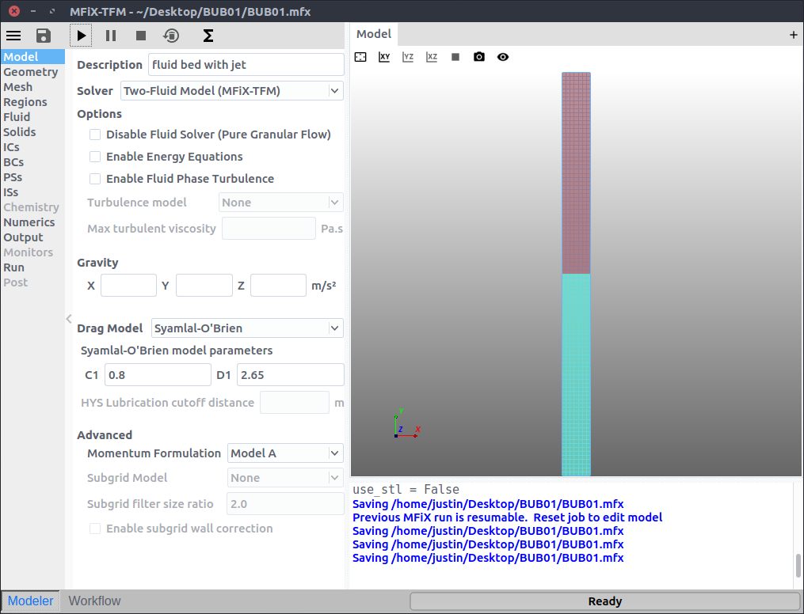

# MFIX User Guide

This document explains how to run MFIX 17.1, using either the GUI or the command line.

This document assumes MFIX is already installed. For information on building or
installing MFIX, please see the setup guide: [INSTALL.html](INSTALL.html)

Everything in this document applies to each platform (Linux, Mac, Windows)
unless otherwise noted.

## About MFIX

MFIX is an open-source multiphase flow solver and is free to download and use. A
one-time no-cost registration is required prior to downloading the source code.
To register, go to https://mfix.netl.doe.gov/ and click on the "Register" button
in the upper right corner. Once you have read the notice, you can submit your
application by clicking on "REGISTER." After your application has been reviewed
and accepted, you will receive an email notification and instructions on how to
download the code. Please allow for 2-3 business days for your registration to
be processed.

Potential users may find reviewing the Frequently Asked Questions section of the
MFIX website useful before downloading the code.

## About the GUI
The GUI is written in pure Python, leveraging the strengths of Python for quick
code development, extensive existing libraries, and flexibility. The GUI will
run on any operating system that Python can be installed in including Linux,
Windows, and Mac. The GUI uses Qt either through PyQt4, PyQt5 or PySide
wrappers as the GUI library. The
[Visualization Toolkit (VTK)](http://www.vtk.org/) is used to visualize and
manipulate the input geometry.


## Development state of MFIX models

MFIX provides a suite of models that treat the carrier phase (typically
the gas phase) and disperse phase (typically the solids phase)
differently. Their current state of development is summarized in the
tables below.

**MFIX-TFM (Two-Fluid Model)** is an Eulerian-Eulerian model, which
supports a broad range of capabilities for dense, reacting, multiphase
flows by representing the fluid and solids as interpenetrating continua.
This is the most mature MFIX model and is capable of modeling multiphase
reactors ranging in size from benchtop to industry-scale. Approximation
of the solid phase as a continuum typically allows for faster simulation
time than Lagrangian techniques; however, it also introduces the need
for accurate mathematical models to capture realistic solids phase
behavior. This includes transport properties, heterogeneous reaction
kinetics, and constitutive relations for interaction between fluid and
solid phases, e.g., solids phase drag and interphase heat transfer.

<div>

<div style="float:left">

|                      | Serial   | ^†^DMP   | ^‡^SMP   |
| -------------------- | -------- | -------- | -------- |
| Momentum Equations   | ●        | ●        | ●        |
| Energy Equations     | ●        | ●        | ●        |
| Species Equations    | ●        | ●        | ●        |
| Chemical Reactions   | ●        | ●        |          |
| Cartesian cut-cell   | ●        | ●        | **□**    |

</div>

<div>

[]{#TFM_pic .anchor}{width="3.022222222222222in"
height="1.8520833333333333in"}

</div>

</div>

**MFIX-DEM (Discrete Element Model)** is an Eulerian-Lagrangian model
that treats the fluid phase as a continuum and models the individual
particles of the solid phase. This is a relatively new variation on
MFIX. While the treatment of individual particles can provide higher
fidelity over a broad range of flow regimes (from dilute to packed), it
also very challenging when dealing with very large numbers of particles
for large-scale simulations. These large-scale applications will require
high performance computing (HPC) resources and large amounts of computer
time. Code optimization and speed up are critical research fronts to
support industrial scale applications.

<div>

<div style="float:left">

|                      | Serial   | ^†^DMP   | ^‡^SMP   |
| -------------------- | -------- | -------- | -------- |
| Momentum Equations   | ●        | ●        | ●        |
| Energy Equations     | ●        | ●        |          |
| Species Equations    | ●        | ●        |          |
| Chemical Reactions   | ●        | ●        |          |
| Cartesian cut-cell   | ○        | ○        |          |

</div>

<div>

[]{#DEM_pic .anchor}{width="3.0125in"
height="1.5895833333333333in"}

</div>

</div>

**MFIX-PIC (Multiphase Particle in Cell)** is another
Eulerian-Lagrangian model that represents the fluid as a continuum while
using "parcels" to represent groups of real particles with similar
physical characteristics. The MFIX-PIC approach offers reduced
computational cost over MFIX-DEM as there are typically few parcels to
track and parcel collisions are not resolved. However, the added
modeling approximations influence the overall accuracy of the method.
Development, validation, and optimization of modeling approximations are
critical research fronts.

<div>

<div style="float:left">

|                      | Serial   | ^†^DMP   | ^‡^SMP   |
| -------------------- | -------- | -------- | -------- |
| Momentum Equations   | ●        |          | ○        |
| Energy Equations     |          |          |          |
| Species Equations    |          |          |          |
| Chemical Reactions   |          |          |          |
| Cartesian cut-cell   | ○        | □        |          |

</div>

<div>

[]{#MPPIC_pic
.anchor}{width="3.0104166666666665in"
height="1.7055555555555555in"}

</div>

</div>

**MFIX-Hybrid (Eulerian-Lagrangian-Eulerian)** is a blend of MFIX-TFM
and MFIX-DEM that represents the fluid as a continuum and models solids
as either a continuous phase (TFM) or discrete particles (DEM). This
technique is presently restricted to solving only the momentum equations
to yield hydrodynamic predictions. This model is still in its infancy
and has seen only limited testing.

<div>

<div style="float:left">

|                      | Serial   | ^†^DMP   | ^‡^SMP|
| -------------------- | -------- | -------- | ------|
| Momentum Equations   | ○        | ○        | ○     |
| Energy Equations     |          |          |       |
| Species Equations    |          |          |       |
| Chemical Reactions   |          |          |       |
| Cartesian cut-cell   | ○        | ○        | ○     |

</div>

[]{#Hybrid_pic .anchor}{width="3.017361111111111in" height="1.601388888888889in"}

<div>

</div>

</div>

● – implemented and fully tested

○ – implemented with limited testing

**□** – not tested or status unknown

† Models not extended to DMP-parallel are only available for serial
runs.

‡ Models not extended to SMP-parallel are available for SMP runs but do
not scale with thread count.

# Quick Start Running MFIX with the GUI

The MFIX install should put an `mfix` binary in your PATH. To start the MFIX GUI, run:

```shell
> mfix
```

> Note: If this is the first time opening the GUI, the File menu will
> automatically open. Otherwise, the previous project will automatically open.

 - Click on the  button
 - Filter the templates by de-selecting the ,
, and
 icons
 - Create a new project by double-clicking on fluidbed1.
 - Enter a project name and browse to a location for the new project.

 > Note: A new project directory will be created in the location directory, with
 > the name being the project name.


 - Click the Start button  to start the MFIX simulation.



 - Click Ok to use the default mfixsolver installed with MFIX.


 - The simulation runs with output in the Terminal Window.


# User Interface Reference

## Main Toolbar

The Main toolbar is always visible and contains the major actions of the GUI.
This includes opening the File menu, Saving the project, Starting a simulation,
Pausing a simulation, Stopping a simulation, Resetting the project, and opening
the parameter dialog.

| Icon                                              | Description                                                               |
|---------------------------------------------------|---------------------------------------------------------------------------|
|               | Shows the  file menu for creating, opening, and saving project files.     |
|             | The save button saves the project file.                                   |
|            | The Start button displays the Run dialog, or un-pauses a simulation.      |
|           | The Pause button pauses a simulation.                                     |
|             | The Stop button stops a simulation.                                       |
|   | The Reset button deletes output data.                                     |
|  | The Parameters menu allows changing of parameters.                        |

If no MFIX job is currently running, the Start button will open the run dialog
where settings for job can be changed. The simulation can be started from this
dialog. If an MFIX job is running, you can pause it with the pause button and
un-pause it with the start button. You can stop a running MFIX job with the stop
button. A stopped job leaves restart (\*.RES) and output files to resume the
simulation. Starting a job by pressing the Start button with \*.RES files
present will resume the job where it stopped. The Rest button will allow the
option to delete the \*.RES files and output files from the project directory.
This will allow the simulation to start from the beginning when the Start button
is pressed.

### Run dialog

The run dialog allows for running the simulation from the GUI. The following
options can be changed in this dialog:

 - Threads (number of threads used for OpenMP)
 - NODESI (number divisions in X direction)
 - NODESJ (number divisions in Y direction)
 - NODESK (number divisions in Z direction)

 $NODESI \times NODESJ \times NODESK = n$ where $n$ is the number of MPI processes running. If not using MPI, $NODESI=NODESJ=NODESK=1$.

The GUI supports running both locally as well as submitting to a queue.

#### Run Local

To run locally, select the "Run local MFiX executable" tab. Select an executable
from the dropdown list or click the browse button to specify an executable that
is not in the list. Usually the default installed solver should be sufficient.
If running a case with UDFs, you need to first build a case-specific MFIX as
described in the [setup guide](INSTALL.html#building-custom-mfixsolver). You may
want to build your own solver for other reasons, such as specifying various
compiler flags to optimize the executable for your specific hardware.

Click "Run" in the Run dialog to start the simulation.


#### Submit to Queue

To submit a job to a queue (submit to queuing system, e.g. Grid Engine, PBS,
SLURM), select the "Submit to Queue" tab. Select an executable from the drop-down
list or click the browse button to specify an executable that is not in the
list. Next, select a template from the drop-down list or click the browse button
to choose a template that is not in the drop-down list. Based on the selected
template, the widgets in the "queue options" section will update automatically.
Once the options are specified, click "submit" in the run dialog to submit the
job to the queue.

Custom queue scripts are supported. The format for this script is described in the
[Queue Templates](#queue-templates) section.


### Reset Dialog

The Reset dialog allows for optional deleting of output files from the run
directory. These files include:

| File Type | Wild-card match                                                   |
|-----------|-------------------------------------------------------------------|
| Restart   | \*.RES                                                            |
| SPx       | \*.SP?                                                            |
| VTK       | \*.vtp, \*.vtu, \*.pid                                            |
| Other     | \*.OUT, \*.pid, \*.error, \*.e[0-9]\*, \*.pe[0-9]\*, \*.po[0-9]\* |

\*.RES and \*.SPx files have to be removed from the run directory before a
simulation can be played from the beginning. It is recommended to remove VTK
files from the run directory as well because they will be over-written.

> Note: If there are restart files present in the run directory, some widgets
> will be disabled because certain model parameters can not be edited during a
> resume, or restart state.


### Parameter Dialog

The parameter dialog allows users to create parameters, or variables, that can
then be referenced in widgets that support the use of these parameters. This
functionality allows user to create relationships among various inputs and
change the values of multiple items by changing the value of a single parameter.
In many respects, this is a similar feature that is present in most commercial
CAD packages.


## File menu

The file menu allows for opening, creating, copying, and exporting projects as
well as viewing project meta data, changing settings, and viewing available help
documentation, including this document.

### Project Info

Displays metadata about the current project file.

| Label                     | Description                                            |
|---------------------------|--------------------------------------------------------|
| Project Version           | version number incremented each time project is saved  |
| Created with MFiX Version | version of MFiX that project was created with          |
| Author                    | user-name that created the project                     |
| Modified By               | list of user-names that edited the project             |
| Last Modified             | date the project was last modified                     |
| Created                   | date the project was created                           |
| Notes                     | area where the user can record notes about the project |

### New

Create a new project file from a template file. When a template is selected, the
GUI will ask for a project name and parent directory to save the project to. A
new directory with the project name will be created in the parent directory. A
<project_name>.mfx file will be created in that directory by copying the
contents of the selected template file. Any other files, such as \*.stl files,
will also be copied if present. The list of templates can be filtered by
selecting one or more of the following model types:

| Icon                                      | Description                            |
|-------------------------------------------|----------------------------------------|
|        | Single phase Model                     |
|              | Two Fluid Model (TFM)                  |
|              | Particle in Cell Model (PIC)           |
|              | Discrete Element Model (DEM)           |
|        | Hybrid Model (TFM + DEM)               |
|    | Cartesian cut-cell (complex) geometry  |
|  | Chemistry                              |

### Open

Open a existing project. You can import mfix.dat files from previous releases of
MFiX, but the GUI will save them as a new filename with a \*.mfx extension. The
GUI also performs a number of conversions, including converting old keywords to
new keywords and conversion from CGS units to SI units. It is strongly suggested
that the project be checked after this conversion.

### Save

Saves the current project.

### Save As

Saves the current project to a new directory and/or as a new filename. The
project is then opened in that location and with that filename.

### Export Project

Export the current project to a new directory and/or as a new filename, but keep
the original project opened.

### Settings

Change settings that affect how the GUI acts.

| Option                 | Description                                                 |
|------------------------|-------------------------------------------------------------|
| Style                  | change the application style                                |
| Enable animations      | enable or disable animated widgets                          |
| Animation Speed        | set the speed at which animations occur                     |
| Enable Developer Tools | hide/show widgets that are mainly for developers of the GUI |

### Help

Shows available documentation (including this document) and tutorial videos
(if connected to the Internet) demonstrating features of the GUI.

### About

Displays the version of MFIX and the versions of the various dependencies that
the GUI is using.

### Quit

Exits MFIX. Will ask for confirmation if project is unsaved or if a job is
running.

## Model panes

Each pane in the main window allows editing of different options for an MFIX
simulation. Panes are ordered following a logical progression of how a
simulation is created.

> Note: selections on panes may enable or disable widgets based on what input
> parameters are required or available.

### Model Setup

The Model pane is used to specify overall options for the simulation. Depending
on what is selected, other panes may be enabled or disabled. Options that are
specified on this pane include:

 - Solver (Single Phase, Two-Fluid Model, DEM, PIC, Hybrid)
 - Option to disable the fluid phase
 - Option to enable thermal energy equations
 - Option to enable turbulence, if the fluid phase is enabled
 - Gravity in the x, y, and z directions
 - Drag Model including parameters for the selected drag model

Other advanced options that can be selected include:

 - Momentum formulation (Model a, Model B, Jackson, or Ishii)
 - Sub-grid model (only available with TFM, Wen-Yu drag model, etc...)
 - Sub-gird filter size
 - Sub-grid wall correction

### Geometry

The Geometry pane allows the specification of the model geometry. This includes
specifying the domain extents (xmin, xmax, ymin, ymax, zmin, zmax) and 2D/3D
selection. If there is complex geometry, the "Auto-size" button can
automatically set the extents to encompass the geometry.

The geometry section provides tools for adding, applying filters, using
automated wizards to create and copy geometry, remove, copy, and perform Boolean
operations on the geometry. All the geometry operations and visualizations are
performed using the [Visualization Toolkit (VTK)](http://www.vtk.org/)'s methods
and functions.

Geometry tool-bar icons:

| Icon                                        | Description                                       |
|---------------------------------------------|---------------------------------------------------|
|      | add geometry to model                             |
|          | apply a filter to the currently selected geometry |
|            | use a wizard to create or copy geometry           |
|          | remove the selected geometry                      |
|              | copy the selected geometry                        |
|            | perform a union of the selected geometry          |
|    | perform a intersection of the selected geometry   |
|  | perform a difference of the selected geometry     |


#### Adding Geometry
Geometry can be added by pressing the add geometry icon and selecting the
geometry to add. There are two types of geometric objects supported in the GUI,
polydata (triangles, like STL files) and implicit functions (quadrics). Boolean
operations can not be performed between polydata and implicit geometry types.
The implicit function needs to be converted to polydata by using the `sample
implicit` filter. Converting the implicit function also needs to be done in
order for the GUI to export a STL file that the mifxsolver can use.

In the geometry tree, the geometry object is described with an icon:

| Icon                                        | Geometry Type |
|---------------------------------------------|---------------|
|      | polydata      |
|      | implicit      |
|          | filter        |
|            | union         |
|    | intersect     |
|  | difference    |


The following geometric objects can be added:
- STL file(s)
- Implicit (Quadric) functions
    - sphere
    - box
    - cylinder
    - cone
    - quadric
    - superquadric
- Primitives
    - sphere
    - box
    - cylinder
    - cone
- Parametrics (torus, boy, conic spiral, etc.)

#### Applying Filters
Filters can be applied to selected geometry by first, selecting the geometry the
filter will be applied to, next pressing the filter icon
and finally, selecting a filter from the filter menu. The filter options can be
edited in the parameter section. The following filters are included:

| Filter                | Description                                                          | vtk class                     |
|-----------------------|----------------------------------------------------------------------|-------------------------------|
| sample implicit       | converts an implicit function to polydata                            | vtkSampleFunction             |
| transform             | rotate, scale, translate polydata                                    | vtkTransformPolyDataFilter    |
| clean                 | merge duplicate points and remove unused points and degenerate cells | vtkCleanPolyData              |
| fill holes            | fill holes                                                           | vtkFillHolesFilter            |
| triangle              | make sure all polys are triangles                                    | vtkTriangleFilter             |
| decimate              | reduce the number of triangles                                       | vtkDecimatePro                |
| quadric decimation    | reduce the number of triangles                                       | vtkQuadricDecimation          |
| quadric clustering    | reduce the number of triangles                                       | vtkQuadricClustering          |
| linear subdivision    | subdivide based on a linear scheme                                   | vtkLinearSubdivisionFilter    |
| loop subdivision      | subdivide based on the Loop scheme                                   | vtkLoopSubdivisionFilter      |
| butterfly subdivision | subdivide based on 8-point butterfly scheme                          | vtkButterflySubdivisionFilter |
| smooth                | move points based on Laplacian smoothing                             | vtkSmoothPolyDataFilter       |
| windowed sinc         | move points based on a windowed sinc function interpolation kernel   | vtkWindowedSincPolyDataFilter |
| reverse sense         | reverse order and/or normals of triangles                            | vtkReverseSense               |


#### Wizards

Four wizards have been included to perform routine tasks when setting up
multiphase flow simulations. These wizards allow for creating cyclones,
reactors, and hoppers. The distributed wizard can also be used to distribute one
geometry inside another geometry with random, cubic, or body centered cubic
positions. Random rotations can also be applied with the wizard.

  

#### Boolean Operations

Boolean operations can be performed with geometry objects of the same type
(implicit, polydata). Boolean operations can not be performed between polydata
and implicit geometry types. The implicit object needs to be first converted to
a polydata object using the sample implicit filter.

> Note: boolean operation between two polydata objects can crash the GUI due to
> segfaults in vtk.

### Mesh

The Mesh pane allows for the specification of the background mesh, add/remove
control points in the x, y, and z directions as well as change various
cut-cell tolerances.

#### Background Mesh

On the Background sub-pane, a uniform mesh can be specified by entering the
number of cells in the x, y, and z directions. Control points can be added by
pressing the  button. Once a control point has been
added, the position, number of cells, stretch, first and last parameters can be
changed. A control point can be split evenly by `right-click` on the control
point to be split and selecting split. This operation will create a new control
point at the midpoint between the previous control point and the selected
control point, dividing the cells evenly between the two. Control points can be
removed by pressing the  button.

The stretch parameter is a value that will apply a non-uniform grid spacing to
the cells. The value is defined as ${Last Width} \over {First Width}$. a value
larger than 1 stretches the grid as x increases, while a value smaller than one
compresses the grid as x increases. A value of 1 will keep the spacing uniform.

The first and last values allow the specification of the first and last widths,
the other cell widths adjust accordingly. If a negative value is specified for
first, the last width from the previous grid segment is copied. If a negative
value is specified, the first width from the next segment is copied.

#### Mesher

Currently, meshing of complex geometry is performed at runtime of the
mfixsolver. The Mesher sub-pane exposes options to adjust the cut-cell mesher.
These options include:

| Option                 | Description                                                                                                                                                                          |
|------------------------|--------------------------------------------------------------------------------------------------------------------------------------------------------------------------------------|
| External flow          | select internal or external flow. Note: this depends on which way the normals are pointing on the STL file. If they are pointing out of the geometry, then the text will be correct. |
| Small cell tolerance   | tolerance to detect, and remove small cells                                                                                                                                          |
| Small area tolerance   | tolerance to detect, and remove cells with small faces                                                                                                                               |
| Merge tolerance        | tolerance used to merge duplicate nodes                                                                                                                                              |
| Snap tolerance         | tolerance to move an intersection point to an existing cell corner                                                                                                                   |
| Allocation Factor      | factor used in allocation of cut-cell arrays                                                                                                                                         |
| Maximum iterations     | maximum number of iterations used to find intersection points                                                                                                                        |
| Intersection tolerance | tolerance used to find intersection of background mesh and STL triangles                                                                                                             |
| Facet angle tolerance  | ignore STL facets that have an angle less than this tolerance                                                                                                                        |
| Dot product tolerance  | tolerance used to determine if a point lies in a facet                                                                                                                               |
| Max facets per cell    | maximum number of facets allowed in a cell                                                                                                                                           |

### Regions

The Regions pane is used to define spatial regions (points, lines, planes,
boxes, or STLs) of the simulation space that are referred to later when
creating:
- [Initial Conditions](#initial-conditions)
- [Boundary Conditions](#boundary-conditions)
- [Point Sources](#point-sources)
- [Outputs](#outputs)

| Icon                                              | Description                                       |
|---------------------------------------------------|---------------------------------------------------|
|                      | create a new region                               |
|                | delete the selected region                        |
|                    | duplicate the selected region                     |
|        | create a region the encompasses the entire domain |
|      | create a region on the left side of the domain    |
|    | create a region on the right side of the domain   |
|        | create a region on the top side of the domain     |
|  | create a region on the bottom side of the domain  |
|    | create a region on the front side of the domain   |
|      | create a region on the back side of the domain    |

A new region can be created by pressing the 
button. Once the region is created, make sure to give the region a descriptive
name so that it can be referred to later. You can change the color of the region
by pressing the color icon. This will change the color in the model setup
view. Next, define extents of the region in the x, y, and z directions. These
widgets take special parameters, `min` and `max`, that reference the minimum and
maximum values of the domain, as specified in the [geometry section](#geometry).
These values will get automatically updated if the extents in the geometry
section are ever updated. The region type will be inferred from the specified
extents.

If the region needs to be a collection of triangles from the STL file, select
the Select Facets (STL) check-box. The selection shape can be changed between a
box and an ellipsoid. Triangles to fall on the edge of the shape can be sliced
by selecting the Slice Facets check-box. The triangle can be further filtered by
the normal direction be specifying an vector and an deviation angle around that
vector.

> Note: Once a region is in use, the region can not be deleted and the type can
> not be changed. This is controlled by disabling those widgets. The Used By
> field will show what is using the region.

### Fluid

The fluid pane is used to defined the physical properties of each fluid phase.

### Solids

The solids phase is used to defined the physical properties of each solids
phase.

#### TFM
#### DEM
#### PIC

### Initial Conditions

The initial conditions pane is used to define initial conditions for each Region
(defined on each Region pane) for each phase (defined on Fluid or Solids panes).

 - Volume fraction
 - Temperature
 - Pressure
 - Velocity

### Boundary Conditions

The boundary conditions pane is used to define boundary conditions for each
Region (defined on each Region pane) for each phase (defined on Fluid or Solids
panes).

 - Volume fraction
 - Pressure
 - Velocity

### Point Sources
### Internal Surfaces
### Chemistry
### Numerics

 - Residuals
 - Discretization
 - Linear Solver
 - Preconditioner
 - Advanced

### Outputs

 - Basic
 - VTK
 - SPx
 - NetCDF

### Monitors
### Run

The Run pane is used to define parameters related to how long the simulation
runs.

 - Stop time
 - Time step
 - Maximum time step
 - Minimum time step
 - Time step factor

### Post-processing

## Visualization window

The visualization window provides a collection 3D views and 2D plots for
visualizing the model setup and model outputs. New windows, or tabs, can be
created by pressing the  button. Once the tab has
been added, the type of view can be selected. Tabs can be closed by pressing the
 button located on the tabs.

### Model

The Model tab is always present and cannot be closed. This 3D view shows the
setup of the simulation including the background mesh, geometry, and regions.

The scene can be manipulated with the mouse and the tool-bar buttons:

| Icon                                          | Description                                         |
|-----------------------------------------------|-----------------------------------------------------|
|        | Reset view, make all items visible                  |
|                    | Change to XY view                                   |
|                    | Change to XZ view                                   |
|                    | Change to YZ View                                   |
|  | Toggle between perspective and parallel projections |
|            | Save an image of the current view                   |
|    | Change the visibility and properties of actors      |

The visibility menu allows for the manipulation of how the objects in the scene
represented including:

- changing the visibility with the 
button
- changing the representation (wire, solids, edges, and points)
- changing the color
- changing the transparency of the objects


### Plot Tab(s)

The plot tab(s) can be used to graph live statistics about the simulation as it
is running. Values such as the time step (dt), number of iterations (nit), and
the simulated time (time) can be plotted. The plot can be manipulated with the
mouse, and a `right-click` menu provides access to options that can be
changed as well as export options for saving an image of the plot or exporting
the data to a text file.

> Note: plotting requires the optinal `pyqtgraph` dependency and a connection to
> the pymfixsolver


### VTK Tab(s)

The VTK tab has been designed to provide a simple way to quickly view results
from the simulation. For more complex visualization of simulation data, please
use software, such as Paraview, instead of this simple viewer. The tab
automatically sets-up VTK pipelines for reading and showing \*.vtu and \*.vtp
files.

> Note: The directory is automatically searched every second for \*.pvd files.
> If a \*.pvd file is found, the GUI will read and show the new VTK file if the
>  button is pressed.

Simulation results can be "played" as well as manipulated using the following
tool-bar:

| Icon                                          | Description                                                        |
|-----------------------------------------------|--------------------------------------------------------------------|
|        | Reset view, make all items visible                                 |
|                    | Change to XY view                                                  |
|                    | Change to XZ view                                                  |
|                    | Change to YZ View                                                  |
|  | Toggle between perspective and parallel projections                |
|            | Save an image of the current view                                  |
|    | Change the visibility and properties of actors                     |
|              | Go to the first frame                                              |
|                | Go back one frame                                                  |
|                | Play available frames, starting at the current frame               |
|                | Go to the next frame                                               |
|                | Go to the last frame                                               |
|              | Change the playback speed, or the amount of time in between frames |

The visibility menu allows for the manipulation of how the objects in the scene
represented including:

- visibility
- the data array used to color
- color bars
- transparency

Further options for the points can be adjusted by clicking the
 button next to the label including:

- Maximum number of particles to be displayed
- The mapper (sprites requires VTK version 7.0+)
- The glyph object

## Terminal window

The terminal window displays the output of the mfixsolver job that would be
displayed when running the solver on the command line. Error messages and
warnings, from both the GUI and a running mfixsolver, are displayed and colored
in red.

Informational messages from the GUI unrelated to the solver are colored in blue.

## Mode bar

The Mode bar allows switching the GUI between various modes including:

 - Modeler, used to setup a simulation
 - Workflow, future feature to support creation, management, post processing,
 and optimization of simulations.

A status bar is also present, showing the current status of the GUI or a running
simulation, including a progress bar showing the current progress of the
simulation and elapsed time.

# Running MFIX with the command line

The command line version of MFIX works the same as in previous MFIX releases.
The main difference is that it is now called `mfixsolver` to distinguish the
command from the MFIX GUI command, `mfix`.

You may still want to run the GUI if you do not have Python on your platform, or
if you want to use features not yet supported by the GUI.

# Appendix

## Queue Templates

Custom queue templates allow users to customize the functionality of the GUI for
their specific system. Queue templates included with the source can be found in
the `MFIX_HOME\queue_templates` directory. Queue templates are files that
contain two sections. The first section is the configuration section that tells
the GUI what widgets to display as well as various options for those widgets.
The second section is the actual script that is executed.

Variables can be used throughout the template, including with the widgets, and
are reference by `${my_variable}`. There are a couple of built in variables
including:

| Variable     | Description                                   |
|--------------|-----------------------------------------------|
| SCRIPT       | the path of this script, in the run directory |
| PROJECT_NAME | the name of the project                       |
| JOB_ID       | the job id extracted from the submit command  |
| COMMAND      | the command that executes mfix                |

The configuration section starts with `## CONFIG` and ends with `## END CONFIG`.
The format follows the `Microsoft Windows INI` format. Sections are defined with
a `[section]` header, followed by a collection of `key=value` or `key: value`
entries for defining parameters. For example:

```
## CONFIG
[My Section]
foodir: %(dir)s/whatever
dir=frob
long: this value continues
   in the next line
## END CONFIG
```

The configuration section has a special section called `[options]` where the
following options can be specified:

| Key          | Description                                                                      |
|--------------|----------------------------------------------------------------------------------|
| name         | name of the template, this is displayed in the template drop-down box in the GUI |
| job_id_regex | regular expression to extract the job id from the output of the submit command   |
| status_regex | regular expression to extract the job status from the status command             |
| submit       | the submission command                                                           |
| delete       | the job cancel or delete command                                                 |
| status       | the job status command                                                           |

An example of values that work with Grid Engine:

```
[options]
name: Joule
job_id_regex: (\d+)
status_regex: ([rqw])
submit: qsub ${SCRIPT}
delete: qdel ${JOB_ID}
status: qstat -j ${JOB_ID}
```
To define a new variable and widget to edit that variable in the GUI, create a
new section:

```
[my_value]
```

The widget and options for that widget can then be selected by specifying
various parameters including:

| Parameter | Description                                         | Values                                                         |
|-----------|-----------------------------------------------------|----------------------------------------------------------------|
| widget    | the widget to be used                               | `lineedit`, `combobox`, `checkbox`, `spinbox`, `doublespinbox` |
| label     | text to be placed beside the widget                 | `any string`                                                   |
| value     | default value                                       | a value such as `1`, `10.3`, `True`, `some text`               |
| items     | list of items for the combobox                      | items delimited by &#124; character                            |
| help      | text to be displayed in the tooltip for that widget | `this widget does this`                                        |
| true      | value to be returned if a checkbox is checked       | a value such as `1`, `10.3`, `True`, `some text`               |
| false     | value to be returned if a checkbox is un-checked    | a value such as `1`, `10.3`, `True`, `some text`               |

An example defining a combo box:

```
[my_email]
widget: combobox
label: email
value: you@mail.com
items: you@mail.com|
       me@mail.net|
       hi@mail.org
help: email to send notifications to
```

The value of this widget can now be referenced throughout the template with
`${my_email}`

The rest of the configuration file, outside of the `## CONFIG` to
`## END CONFIG` section is the script that needs to be executed to submit a job
to your specific queue system. For example, with Grid Engine on Joule, the
following script specifies the job name, job type, cores, and queue as well as
loads the required modules and finally runs mfix with `${COMMAND}`.

```
## Change into the current working directory
#$ -cwd
##
## The name for the job. It will be displayed this way on qstat
#$ -N ${JOB_NAME}
##
## Number of cores to request
#$ -pe ${JOB_TYPE} ${CORES}
##
## Queue Name
#$ -q ${QUEUE}
##

##Load Modules
module load ${MODULES}
##Run the job
${COMMAND}
```
