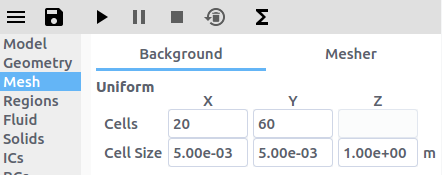

# Tutorials

## Two-Fluid Models (MFiX-TFM)

### 2D Fluid Bed

This tutorial shows how to create a two dimensional fluidized bed simulation
using the two fluid model. The model setup is:

| Property       | Value                  |
|----------------|------------------------|
| geometry       | 10 cm x 30 cm          |
| mesh           | 20 x 60                |
| solid diameter | 200 microns (200e-6 m) |
| solid density  | 2500 kg/m2             |
| gas velocity   | 1 m/s                  |
| temperature    | 298 K                  |
| pressure       | 101325 Pa              |

1. Create a new project
  - On the file menu click on the  button
  - Create a new project by double-clicking on "Blank" template.
  - Enter a project name and browse to a location for the new project.

> Note: A new project directory will be created in the location directory, with
> the name being the project name.

2. Select model parameters
  - On the `Model` pane, enter a descriptive text in the `Description` field
  - Select "Two-Fluid Model (MFiX-TFM)" in the `Solver` combo-box.

3. Enter the geometry
  - On the `Geometry` pane select the `2 Dimensional` checkbox
  - Enter "10/100" for the maximum x value
  - Enter "30/100" for the maximum y value

4. Enter the mesh
  - On the `Mesh` pane, `Background` sub-pane
    - Enter "20" for the x cell value
    - Enter "60" for the y cell value

5. Create regions for initial and boundary condition specification

## Multiphase Particle in Cell Models (MFiX-PIC)

## Discrete Element Models (MFiX-DEM)

## Eulerian-Lagrangian-Eulerian (MFiX-Hybrid)
