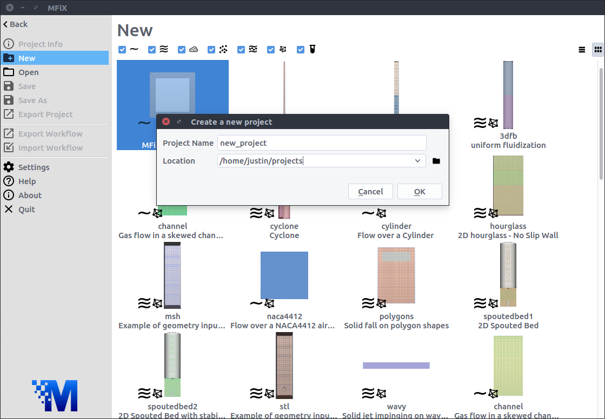
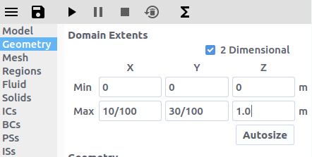
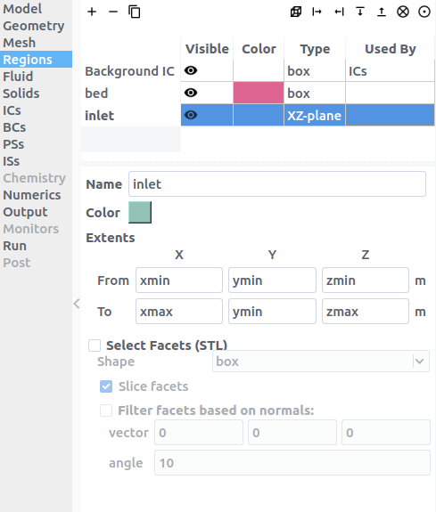

# Tutorials

## Two-Fluid Models (MFiX-TFM)

### 2D Fluid Bed

This tutorial shows how to create a two dimensional fluidized bed simulation
using the two fluid model. The model setup is:

| Property       | Value                  |
|----------------|------------------------|
| geometry       | 10 cm x 30 cm          |
| mesh           | 20 x 60                |
| solid diameter | 200 microns (200e-6 m) |
| solid density  | 2500 kg/m2             |
| gas velocity   | 1 m/s                  |
| temperature    | 298 K                  |
| pressure       | 101325 Pa              |

#### Step 1. Create a new project
- On the file menu click on the  button
- Create a new project by double-clicking on "Blank" template.
- Enter a project name and browse to a location for the new project.

> Note: A new project directory will be created in the location directory, with
> the name being the project name.

#### Step 2. Select model parameters
- On the `Model` pane, enter a descriptive text in the `Description` field
- Select "Two-Fluid Model (MFiX-TFM)" in the `Solver` combo-box.

#### Step 3. Enter the geometry
- On the `Geometry` pane select the `2 Dimensional` checkbox
- Enter "10/100" meters for the maximum x value
- Enter "30/100" meters for the maximum y value

#### Step 4. Enter the mesh
- On the `Mesh` pane, `Background` sub-pane
  - Enter "20" for the x cell value
  - Enter "60" for the y cell value

#### Step 5. Create regions for initial and boundary condition specification
- click the  button to create a new region to be used for the bed initial condition.
  - Enter a name for the region in the `Name` field
  - Change the color by pressing the `Color` button
  - Enter "xmin" or "min" in the `From X` field
  - Enter "xmax" or "max" in the `To X` field
  - Enter "ymin" or "min" in the `From Y` field
  - Enter "ymax/2" or "max" in the `To Y` feild
  - Enter "zmin" or "min" in the `From Z` field
  - Enter "zmax" or "max" in the `To Z` feild

- Click the  button to create a new region with the `From` and `To` fields already filled out for a region at the bottom of the domain, to be used by the gas inlet boundary condition. `From Y` should equal `To Y`, defining an XZ-plane.
  - Enter a name for the region in the `Name` field

- Click the  button to create a new region with the `From` and `To` fields already filled out for a region at the top of the domain, to be used by the pressure outlet boundary condition. `From Y` should equal `To Y`, defining an XZ-plane.
  - Enter a name for the region in the `Name` field

#### Step 6. Create a solid

- Click the  button to create a new solid
- Enter a descriptive name in the `Name` field
- Enter the particle diameter of "200e-6" in the `Diameter` field
- ENter the particle density of "2500" in the `Density` field

## Multiphase Particle in Cell Models (MFiX-PIC)

## Discrete Element Models (MFiX-DEM)

## Eulerian-Lagrangian-Eulerian (MFiX-Hybrid)
