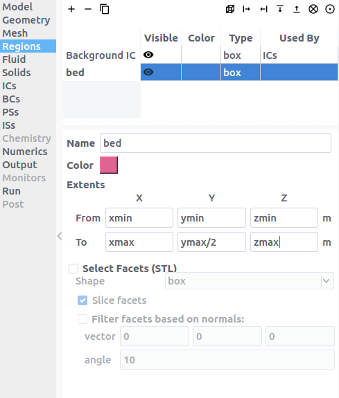
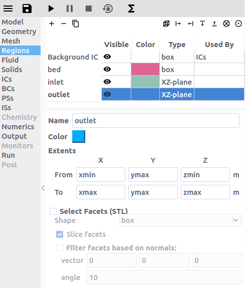
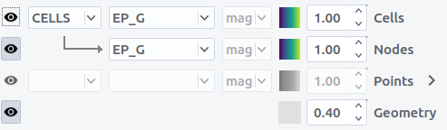

# Tutorials

## Basic Tutorials

### 2 Dimensional Fluid Bed, Two Fluid Model (TFM)

This tutorial shows how to create a two dimensional fluidized bed simulation
using the two fluid model. The model setup is:

| Property       | Value                  |
|----------------|------------------------|
| geometry       | 10 cm x 30 cm          |
| mesh           | 20 x 60                |
| solid diameter | 200 microns (200e-6 m) |
| solid density  | 2500 kg/m2             |
| gas velocity   | 0.25 m/s               |
| temperature    | 298 K                  |
| pressure       | 101325 Pa              |

#### Step 1. Create a new project
- On the file menu click on the  button
- Create a new project by double-clicking on "Blank" template.
- Enter a project name and browse to a location for the new project.

> Note: A new project directory will be created in the location directory, with
> the name being the project name.

#### Step 2. Select model parameters
- On the `Model` pane, enter a descriptive text in the `Description` field
- Select "Two-Fluid Model (MFiX-TFM)" in the `Solver` combo-box.

#### Step 3. Enter the geometry
- On the `Geometry` pane select the `2 Dimensional` checkbox
- Enter "10/100" meters for the maximum x value
- Enter "30/100" meters for the maximum y value
> Note: We could have entered 0.1 and 0.3 to define the domain extents,
> but this example shows that simple mathematical expressions are allowed.

#### Step 4. Enter the mesh
- On the `Mesh` pane, `Background` sub-pane
  - Enter "20" for the x cell value
  - Enter "60" for the y cell value

#### Step 5. Create regions for initial and boundary condition specification

- Select the `Regions` pane. By default, a region that covers the entire domain
is already defined. This is typically used to initialize the flow field and
visualize the results.
- click the  button to create a new region to be
used for the bed initial condition.
  - Enter a name for the region in the `Name` field ("bed")
  - Change the color by pressing the `Color` button
  - Enter "xmin" or "min" in the `From X` field
  - Enter "xmax" or "max" in the `To X` field
  - Enter "ymin" or "min" in the `From Y` field
  - Enter "ymax/2" or "max" in the `To Y` field
  - Enter "zmin" or "min" in the `From Z` field
  - Enter "zmax" or "max" in the `To Z` field
> Note: Here we could have entered numerical values for the coordinates, but it is recommended to use paramaters (xmin, xmax etc.) when possible.

- Click the  button to create a new
region with the `From` and `To` fields already filled out for a region at the
bottom of the domain, to be used by the gas inlet boundary condition. `From Y`
should equal `To Y`, defining an XZ-plane.
  - Enter a name for the region in the `Name` field ("inlet")

- Click the  button to create a new
region with the `From` and `To` fields already filled out for a region at the
top of the domain, to be used by the pressure outlet boundary condition.
`From Y` should equal `To Y`, defining an XZ-plane.
  - Enter a name for the region in the `Name` field ("outlet")

#### Step 6. Create a solid

- Select the `Solids` pane
- Click the  button to create a new solid
- Enter a descriptive name in the `Name` field ("glass beads")
- Keep the model as "Two-Fluid Model (MFiX-TFM)")
- Enter the particle diameter of "200e-6" m in the `Diameter` field
- Enter the particle density of "2500" kg/m2 in the `Density` field

#### Step 7. Create Initial Conditions

- Select the `Initial Conditions` pane
- Select the already populated "Background IC" from the region list. This will initilaize the entire flow field with air.
- Enter "101325" Pa in the `Pressure (optional)` field

- Create a new Initial Condition by pressing the
 button
- Select the region created previously for the bed Initial Condition ("bed"
region) and click the `OK` button.

- Select the solid (named previously as "glass beads") sub-pane and enter a
volume fraction of "0.4" in the `Volume Fraction` field. This will fill the
bottom half with glass beads.

#### Step 8. Create Boundary Conditions

- Select the `Boundary Conditions` pane
- Create a new Boundary condition by clicking the
 button
- On the `Select Region` dialog, select "Mass Inflow" from the `Boundary type`
combo-box
- Select the "inlet" region and click `OK`

- On the "Fluid" sub-pane, enter a velocity in the `Y-axial velocity` field of
"0.25" m/s

- Create another Boundary condition by clicking the
 button
- On the `Select Region` dialog, select "Pressure Outflow" from the
`Boundary type` combo-box
- Select the "outlet" region and click `OK`

> Note: The default pressure is already set to 101325 Pa, no changes need to be
> made to the outlet boundary condition.

> Note: By default, boundaries that are left undefined (here the left and right planes) will behave as No-SLip walls.

#### Step 9. Select output options

- Select the `Output` pane
- On the `Basic` sub-pane, check the `Write VTK output files (VTU/VTP)` checkbox

- Select the `VTK` sub-pane
- Create a new output by clicking the  button
- Select the "Background IC" region from the list to save all the cell data
- Click `OK` to create the output

- Enter a base name for the `*.vtu` files in the `Filename base` field
- Change the `Write interval` to "0.1" seconds
- Select the `Volume fraction`, `Pressure`, and `Velocity vector` check-boxes on
the `Fluid` sub-sub-pane

#### Step 10. Change run parameters

- Select the `Run` pane
- Change the `Time step` to "1e-3" seconds
- Change the `Maximum time step` to "1e-2" seconds

#### Step 11. Run the project

- Save project by clicking  button
- Run the project by clicking the  button
- On the `Run` dialog, select the executable from the combo-box
- Click the `Run` button to actually start the simulation

#### Step 12. View results

Results can be viewed, and plotted, while the simulation is running.

- Create a new visualization tab by pressing the
 in the upper right hand corner.
- Select an item to view, such as plotting the time step (dt) or click the `VTK`
button to view the vtk output files.

- On the `VTK` results tab, the visibility and representation of the `*.vtk`
files can be controlled with the `Visibility` menu.

- Change frames with the ,
, , and
 buttons
- Click the  button to play the available vtk
files.
- Change the playback speed with the  button

### 2 Dimensional Fluid Bed, Discrete Element Model (DEM)

This tutorial shows how to create a two dimensional fluidized bed simulation
using the Discrete Element Model. The model setup is:

| Property       | Value                    |
|----------------|--------------------------|
| geometry       | 5 cm x 10 cm x 2 cm      |
| mesh           | 20 x 40 x 1              |
| solid diameter | 1000 microns (1000e-6 m) |
| solid density  | 2500 kg/m2               |
| gas velocity   | 3.0 m/s                  |
| temperature    | 298 K                    |
| pressure       | 101325 Pa                |
